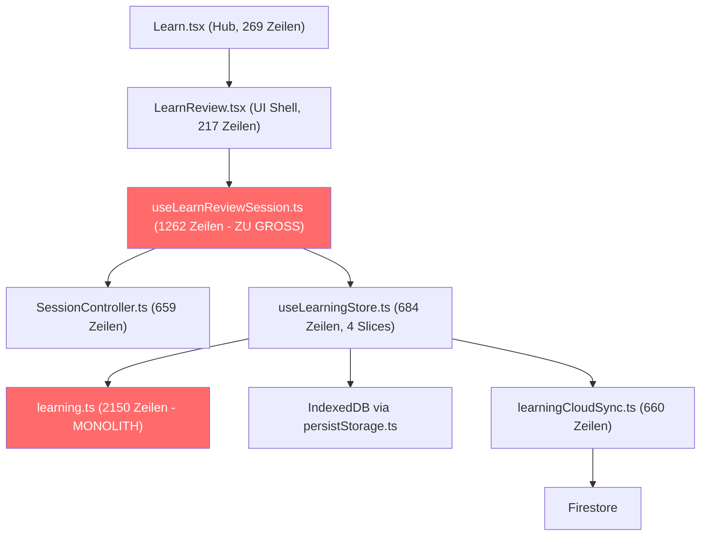

# Fahrplan: Vokabel-Lernsystem reparieren und benutzbar machen

**Datum:** 2026-06-08  
**Kontext:** Das Vokabel-Lernsystem der Blearn-App funktioniert technisch (FSRS, Stores, Anki-Import existieren), aber die UX ist kaputt — man kann im aktuellen Zustand keine Vokabeln vernünftig lernen. Zusätzlich sind mehrere Dateien so aufgebläht, dass sie von Agents kaum noch sinnvoll bearbeitet werden können.

> [!IMPORTANT]
> Dieser Plan ersetzt NICHT den bestehenden Primary Execution Plan (`2026-04-03-blocking-sync-integrity.md`).
> Er ergänzt ihn als fokussierte Arbeit am Lern-/Vokabel-Pfad.

---

## Ist-Zustand: Was kaputt ist

### Problem 1: Monster-Dateien — Agents können damit nicht arbeiten

| Datei | Zeilen | Bytes | Inhalt |
|-------|--------|-------|--------|
| `src/lib/learning.ts` | **~2150** | 67 KB | Entity-Typen + FSRS-Scheduler + CSV-Parser + Queue-Builder + Answer-Normalisierung + Featured Templates — ALLES in einer Datei |
| `src/hooks/useLearnReviewSession.ts` | **~1262** | 42 KB | Review-Logik + Blocking-Flow + Emotion-Step + Navigation + Typed-Answer + Undo — ALLES in einem Hook |
| `src/services/firebaseLearningSyncService.ts` | **~1508** | 54 KB | Toter Code — wird laut Project Memory NICHT aktiv verwendet, existiert aber als paralleler Sync-Pfad |
| `src/pages/Modes.tsx` | **~1128** | 57 KB | Gesamte Blocking-Konfiguration in einer Page |
| `src/pages/AppSettings.tsx` | **~1600+** | 66 KB | Gesamte Settings in einer Page |
| `src/pages/Stats.tsx` | **~1200+** | 49 KB | Statistik-Ansicht monolithisch |

### Problem 2: Vokabeln lernen funktioniert schlecht

- **Kein klarer Einstieg**: User öffnet Learn-Hub und sieht Deck-Stats, aber der Weg "ich will jetzt 20 Wörter lernen" ist nicht intuitiv.
- **Typed-Answer UX ist hakelig**: Normalisierung existiert (ß/ä), aber der Flow fühlt sich nicht wie echtes Lernen an.
- **Kein visuelles Feedback beim Fortschritt**: Es fehlt ein Gefühl von "ich komme voran" während der Session.
- **Keine Session-Zusammenfassung**: Nach dem Lernen gibt's keinen Überblick "Du hast 15 Karten gelernt, 3 wiederholt, 2 Fehler gemacht".
- **Featured Templates sind problematisch**: `jean-paul.json` ist **44 MB** groß — das verursacht Speicherprobleme beim Import.
- **Review-Log-Cap bei 5000**: Älteste Logs werden gelöscht — das zerstört FSRS-Trainingsdaten.
- **UTF-8 Mojibake**: Deutsche Umlaute in Lerndateien sind teilweise kaputt (`Wähle` → `Wähle`).
- **Unlock-Grant-Kollision**: Grants sind nur nach `targetId` gekeys, nicht nach `targetType` — Website und Search-Target mit gleichem Namen kollidieren.

### Problem 3: Bestehende Pläne wurden nie umgesetzt

Es gibt 4 detaillierte Pläne aus März 2026, die alle **unberührt** geblieben sind:
- `phase-1-learning-core-modularization.md` — Refactoring der Monolithen
- `robust-review-engine.md` — ReviewSessionController, Undo, Timer, Feedback
- `phase-4-learning-upgrades.md` — Multi-Cloze, Template-Preview, Per-Deck-Settings
- `card-browser-search-filtered-deck-lite.md` — Card Browser, Filtered Decks

---

## Architektur-Überblick (Ist-Zustand)

---

## Ausführungsplan: 5 Phasen

> [!CAUTION]
> **Reihenfolge ist bindend.** Phase 1 muss vor Phase 2 abgeschlossen sein usw.
> Jede Phase hat klare Abnahmekriterien. Erst wenn die erfüllt sind, geht es weiter.

---

### Phase 1: Monster-Dateien aufbrechen (Refactoring — kein Feature-Change)

**Ziel:** Die drei größten Dateien in handhabbare Module zerlegen, ohne jegliches Verhalten zu ändern.

**Regel:** Kein einziger Test darf brechen. Keine API-Änderung nach außen. Keine neuen Features.

#### 1.1 `src/lib/learning.ts` (2150 Zeilen) → Modul-Struktur

Aufteilen in:

| Neue Datei | Inhalt aus `learning.ts` | Geschätzte Zeilen |
|---|---|---|
| `src/modules/learning/domain/entities.ts` | Alle Typen: `LearningDeck`, `LearningNote`, `LearningCard`, `ReviewLog`, `LearningPreset`, `UnlockGateRule`, `DeckAssignment`, `UnlockGrant` | ~120 |
| `src/modules/learning/domain/constants.ts` | Konstanten, Defaults, `MAX_REVIEW_LOGS`, Preset-Defaults | ~50 |
| `src/modules/learning/review/fsrsScheduler.ts` | FSRS-Scheduling-Logik, Interval-Berechnung, `scheduleCard()` | ~200 |
| `src/modules/learning/review/queueBuilder.ts` | `buildReviewQueue()`, `buildUnlockSessionQueue()`, Due-Card-Selektion | ~200 |
| `src/modules/learning/review/answerNormalization.ts` | `normalizeAnswer()`, `checkTypedAnswer()`, Unicode/Umlaut-Handling | ~80 |
| `src/modules/learning/import/csvParser.ts` | CSV-Import-Logik | ~150 |
| `src/modules/learning/import/jsonParser.ts` | JSON-Import-Logik | ~100 |
| `src/modules/learning/import/templateLoader.ts` | Featured Template-Loading, `getStarterDeckRows()` | ~100 |
| `src/modules/learning/stats/deckStats.ts` | `getDeckStats()`, Due-Counts, Review-Statistiken | ~100 |
| `src/lib/learning.ts` | **Nur noch Re-Exports** aus den neuen Modulen (Barrel-File für Rückwärtskompatibilität) | ~50 |

> [!IMPORTANT]
> `src/lib/learning.ts` bleibt als Barrel-File bestehen und re-exportiert alles.
> Alle bestehenden Imports (`import { ... } from '../lib/learning'`) funktionieren weiter.
> Erst wenn alles stabil ist, können Imports schrittweise auf die neuen Module umgestellt werden.

#### 1.2 `src/hooks/useLearnReviewSession.ts` (1262 Zeilen) → Verantwortlichkeiten trennen

| Neue Datei | Inhalt | Geschätzte Zeilen |
|---|---|---|
| `src/hooks/useLearnReviewSession.ts` | **Nur noch Orchestrierung**: Session-Start, Card-Anzeige, Grade-Delegation | ~300 |
| `src/hooks/useBlockedFlowIntegration.ts` | Blocking-Overlay-Dismiss, Unlock-Handoff, Fallback-to-Breathing | ~200 |
| `src/hooks/useTypedAnswerFlow.ts` | Typed-Answer-Input, Validierung, Attempt-Tracking, Auto-Reveal | ~150 |
| `src/hooks/useSessionCompletion.ts` | Emotion-Step, Checkin-Recording, Unlock-Grant-Erstellung | ~200 |
| `src/hooks/useReviewUndo.ts` | Undo-Stack-Management, History-Traversal | ~100 |

#### 1.3 Toten Code entfernen

- `src/services/firebaseLearningSyncService.ts` (1508 Zeilen): **Löschen** oder in `_deprecated/` verschieben.
  - Wird laut Project Memory "nicht im aktiven Sync-Pfad" verwendet.
  - Zugehörigen Test `firebaseLearningSyncService.test.ts` ebenfalls archivieren.

> [!WARNING]
> Vor dem Löschen von `firebaseLearningSyncService.ts` prüfen:
> 1. Grep nach allen Imports dieser Datei
> 2. Sicherstellen, dass kein Runtime-Code sie aufruft
> 3. Wenn irgendwo aktiv verwendet → nicht löschen, sondern Bug dokumentieren

#### Abnahmekriterien Phase 1

- [ ] `npm run build` erfolgreich
- [ ] Alle bestehenden Tests grün (`npm test`)
- [ ] `src/lib/learning.ts` ist unter 100 Zeilen (Barrel-File)
- [ ] `src/hooks/useLearnReviewSession.ts` ist unter 400 Zeilen
- [ ] Kein einziger Feature-Change — rein strukturell

---

### Phase 2: Lern-UX reparieren — "Ich will jetzt Vokabeln lernen" muss funktionieren

**Ziel:** Den End-to-End-Flow so reparieren, dass ein User seine hochgeladenen Vokabeln tatsächlich lernen kann.

#### 2.1 UTF-8 Mojibake fixen

- **Betroffen:** Verschiedene Stellen in Learn-Dateien mit deutschen Umlauten
- **Aktion:** Alle `.ts`/`.tsx` Dateien im `src/` Verzeichnis nach Mojibake-Patterns scannen (`ä`, `ö`, `ü`, `ß`, `Ä`, `Ö`, `Ãœ`) und durch korrekte UTF-8-Zeichen ersetzen (`ä`, `ö`, `ü`, `ß`, `Ä`, `Ö`, `Ü`)
- **Testbar:** Grep nach `Ã` in allen Source-Dateien muss 0 Treffer ergeben

#### 2.2 Learn-Hub verbessern (`src/pages/Learn.tsx`)

Aktuell 269 Zeilen — gut handhabbar. Änderungen:

- **Klarer CTA**: "Jetzt X Karten lernen" mit konkreter Zahl (fällige + neue Karten)
- **Quick-Start**: Wenn nur ein Deck existiert, direkt "Lernen starten" statt Deck-Auswahl
- **Fortschrittsanzeige**: Täglicher Fortschritt als kleiner Balken (X von Y Karten heute)
- **Leerer Zustand**: Wenn keine Decks existiert, klarer Hinweis "Lade Vokabeln hoch oder wähle ein Template"

#### 2.3 Session-Zusammenfassung nach dem Lernen

Neue Komponente: `src/components/learn-review/LearnReviewSummary.tsx`

Inhalt:
- Karten gelernt (neu + wiederholt)
- Korrekte / Falsche Antworten
- Durchschnittliche Antwortzeit
- Streak-Anzeige (Tage in Folge gelernt)
- "Weiter lernen" oder "Fertig" Button

#### 2.4 Session-Feedback während des Lernens verbessern

- Fortschrittsbalken: "Karte 3 von 15"
- Farbiges Feedback bei Antwort: Grün für richtig, Rot für falsch, mit kurzem Micro-Animation
- Streak-Counter innerhalb der Session ("5 richtig in Folge!")

#### 2.5 Typed-Answer-Flow polieren

- Input-Feld direkt sichtbar bei typed-answer Karten (nicht erst nach Reveal)
- Enter-Taste zum Absenden
- Visueller Diff bei falscher Antwort: "Du hast _X_ geschrieben, richtig wäre _Y_"
- ß/ä/ö/ü Toleranz klar kommunizieren

#### Abnahmekriterien Phase 2

- [ ] UTF-8: `grep -r "ä\|ö\|ü\|ß" src/` ergibt 0 Treffer
- [ ] Ein User mit einem importierten Deck kann eine 10-Karten-Session starten und abschließen
- [ ] Nach der Session wird eine Zusammenfassung angezeigt
- [ ] Typed-Answer-Karten funktionieren mit Enter-Submit und visuellem Diff
- [ ] Learn-Hub zeigt klare Karten-Zählung und CTA

---

### Phase 3: Import und Daten stabilisieren

**Ziel:** Sicherstellen, dass hochgeladene Vokabeln zuverlässig importiert werden und die Daten konsistent bleiben.

#### 3.1 `jean-paul.json` Template-Problem lösen

- 44 MB JSON-Datei in `public/learn-templates/` — verursacht Speicherprobleme
- **Option A (empfohlen):** Streaming-Import mit Chunk-Verarbeitung
- **Option B:** Template in kleinere Teile aufteilen (z.B. je 1000 Karten)
- **Option C:** Template ganz entfernen, wenn es nicht aktiv genutzt wird

#### 3.2 Review-Log-Cap intelligent machen

- Aktuell: Harte Grenze bei 5000 Logs, älteste werden gelöscht
- **Besser:** FSRS-relevante Logs (letzte Review pro Karte) nie löschen, nur redundante Zwischen-Logs kappen
- Oder: Cap auf 10.000 erhöhen und bei Cloud-Sync archivieren

#### 3.3 Unlock-Grant-Kollision fixen

- **Ist:** Grants gekeys nur nach `targetId`
- **Soll:** Grants gekeys nach `targetType:targetId` (z.B. `website:youtube.com`)
- Migration: Bestehende Grants beim Store-Hydrate einmalig umschreiben

#### 3.4 Assignment-API konsistent machen

- `targetType` darf nicht optional sein bei Lookup/Removal
- Alle Stellen prüfen und TS-Typen verschärfen

#### Abnahmekriterien Phase 3

- [ ] Template-Import von >1000 Karten funktioniert ohne Memory-Crash
- [ ] Review-Logs behalten mindestens die letzte Review pro Karte
- [ ] Unlock-Grants sind nach `targetType:targetId` gekeys
- [ ] `DeckAssignment` Lookup akzeptiert `targetType` nicht mehr als optional

---

### Phase 4: Große Pages aufbrechen (Modes, AppSettings, Stats)

**Ziel:** Die verbleibenden Monster-Pages modularisieren.

> [!NOTE]
> Diese Phase ist bewusst NACH dem Lern-Flow priorisiert. Die Pages funktionieren — sie sind nur schwer wartbar.

#### 4.1 `Modes.tsx` (1128 Zeilen)

Aufteilen in:
- `src/pages/Modes.tsx` — Orchestrierung, ~200 Zeilen
- `src/components/modes/ModeSelector.tsx` — Modus-Auswahl UI
- `src/components/modes/BlockedTargetsList.tsx` — App/Website/Search-Listen
- `src/components/modes/LearnAssignmentConfig.tsx` — Learn-Deck-Zuordnung
- `src/hooks/useModesSave.ts` — Save-Logik + Policy-Sync

#### 4.2 `AppSettings.tsx` (~1600 Zeilen)

Aufteilen in Sections:
- `src/components/settings/AccountSection.tsx`
- `src/components/settings/BlockingSection.tsx`
- `src/components/settings/LearningSection.tsx`
- `src/components/settings/AppearanceSection.tsx`
- `src/components/settings/PermissionsSection.tsx`

#### 4.3 `Stats.tsx` (~1200 Zeilen)

Aufteilen in:
- `src/components/stats/LearningStats.tsx`
- `src/components/stats/EmotionStats.tsx`
- `src/components/stats/UsageStats.tsx`
- `src/components/stats/StreakTracker.tsx`

#### Abnahmekriterien Phase 4

- [ ] Keine Page-Datei über 400 Zeilen
- [ ] `npm run build` + alle Tests grün
- [ ] Kein Feature-Change

---

### Phase 5: Erweiterte Lern-Features (erst nach Phase 1-4)

**Ziel:** Die geplanten aber nie umgesetzten Features aus den alten Plänen priorisiert einbauen.

#### 5.1 Multi-Cloze Support

- `{{c1::Wort1}} und {{c2::Wort2}}` soll separate Karten erzeugen
- Referenz: `phase-4-learning-upgrades.md` Task 2

#### 5.2 Per-Deck Review Settings

- `newCardsPerDay`, `maxReviewsPerDay`, `burySiblings` pro Deck
- Referenz: `phase-4-learning-upgrades.md` Task 3

#### 5.3 Card Browser

- `/learn/browser` mit Deck-Filter, Search, Per-Card-Actions
- Referenz: `card-browser-search-filtered-deck-lite.md` Task 1-2

#### 5.4 Session Resume

- Bei App-Crash oder Navigation-Abbruch: Session kann fortgesetzt werden
- Referenz: `robust-review-engine.md` Task 2

#### Abnahmekriterien Phase 5

- [ ] Multi-Cloze: Note mit `{{c1::...}} {{c2::...}}` erzeugt 2 separate Karten
- [ ] Per-Deck Settings: Verschiedene Decks können unterschiedliche Limits haben
- [ ] Card Browser: User kann alle Karten eines Decks durchsuchen und filtern

---

## Regeln für Agents

> [!CAUTION]
> **Diese Regeln gelten für jeden Agent, der an diesem Fahrplan arbeitet:**

1. **Immer zuerst lesen:**
   - `docs/project-memory.md`
   - Diesen Fahrplan (`docs/plans/2026-06-08-vocab-learning-fahrplan.md`)
   - `docs/plans/2026-04-11-native-blocking-architecture.md` (falls Blocking berührt wird)

2. **Kein Blocking-Code anfassen** ohne den Native Blocking Architecture Plan gelesen zu haben.

3. **Dateien nicht im Ganzen neu schreiben.** Immer inkrementell arbeiten: Extract → Re-Export → Test → Nächster Extract.

4. **Tests nach jedem Schritt laufen lassen:** `npm test` und `npm run build`.

5. **Keine neuen Features in Refactoring-Phasen.** Phase 1 und 4 sind rein strukturell.

6. **Install immer als Update:** `adb install -r` — niemals `adb uninstall` oder `pm clear`.

7. **Bei Unsicherheit: Stoppen und fragen.** Lieber eine Phase sauber abschließen als zwei halb.

---

## Bezug zu bestehenden Plänen

| Bestehender Plan | Status | Verhältnis zu diesem Fahrplan |
|---|---|---|
| `phase-1-learning-core-modularization.md` | Nie gestartet | → **Phase 1** hier übernimmt und konkretisiert die Aufteilung |
| `robust-review-engine.md` | Nie gestartet | → **Phase 2** (UX) + **Phase 5.4** (Session Resume) übernehmen Teile |
| `phase-4-learning-upgrades.md` | Nie gestartet | → **Phase 5** übernimmt Multi-Cloze + Per-Deck Settings |
| `card-browser-search-filtered-deck-lite.md` | Nie gestartet | → **Phase 5.3** übernimmt Card Browser |
| `2026-04-03-blocking-sync-integrity.md` | In Arbeit (Primary) | → **Nicht ersetzt**. Dieser Fahrplan ergänzt, konfligiert nicht |

---

## High-Signal Dateien (Schnellreferenz)

### Lern-Core (Phase 1 Hauptziele)
- [learning.ts](file:///C:/Users/psjoh/Desktop/Personal/Coding/Apps/Blearn-App/src/lib/learning.ts) — 2150 Zeilen, MONOLITH
- [useLearnReviewSession.ts](file:///C:/Users/psjoh/Desktop/Personal/Coding/Apps/Blearn-App/src/hooks/useLearnReviewSession.ts) — 1262 Zeilen, MONOLITH
- [firebaseLearningSyncService.ts](file:///C:/Users/psjoh/Desktop/Personal/Coding/Apps/Blearn-App/src/services/firebaseLearningSyncService.ts) — 1508 Zeilen, TOTER CODE

### Lern-UI (Phase 2 Hauptziele)
- [Learn.tsx](file:///C:/Users/psjoh/Desktop/Personal/Coding/Apps/Blearn-App/src/pages/Learn.tsx) — 269 Zeilen
- [LearnReview.tsx](file:///C:/Users/psjoh/Desktop/Personal/Coding/Apps/Blearn-App/src/pages/LearnReview.tsx) — 217 Zeilen
- [sessionController.ts](file:///C:/Users/psjoh/Desktop/Personal/Coding/Apps/Blearn-App/src/modules/learning/session/sessionController.ts) — 659 Zeilen
- [useLearningStore.ts](file:///C:/Users/psjoh/Desktop/Personal/Coding/Apps/Blearn-App/src/store/useLearningStore.ts) — 684 Zeilen

### Monster-Pages (Phase 4 Hauptziele)
- [Modes.tsx](file:///C:/Users/psjoh/Desktop/Personal/Coding/Apps/Blearn-App/src/pages/Modes.tsx) — 1128 Zeilen
- [AppSettings.tsx](file:///C:/Users/psjoh/Desktop/Personal/Coding/Apps/Blearn-App/src/pages/AppSettings.tsx) — ~1600 Zeilen
- [Stats.tsx](file:///C:/Users/psjoh/Desktop/Personal/Coding/Apps/Blearn-App/src/pages/Stats.tsx) — ~1200 Zeilen
